# Spotify_Music_Analysis
### Introduction :
Analysis of song metadata taken from Spotify. 

## Data Description :

`Acousticness:`
* A confidence measure from 0.0 to 1.0 of whether the track is acoustic. 
* 1.0 represents high confidence the track is acoustic.

`Danceability:`
* Danceability describes how suitable a track is for dancing based on a combination of musical elements including tempo, rhythm stability, beat strength, and overall regularity. 
* A value of 0.0 is least danceable and 1.0 is most danceable

`Duration_ms:`
* The duration of the track in milliseconds.

`Energy:` 
* Energy is a measure from 0.0 to 1.0 and represents a perceptual measure of intensity and activity. 
* Typically, energetic tracks feel fast, loud, and noisy. 
* For example, death metal has high energy, while a Bach prelude scores low on the scale. 
* Perceptual features contributing to this attribute include dynamic range, perceived loudness, timbre, onset rate, and general entropy.

`Instrumentalness:` 
* Predicts whether a track contains no vocals. 
* “Ooh” and “aah” sounds are treated as instrumental in this context. Rap or spoken word tracks are clearly “vocal”. 
* The closer the instrumentalness value is to 1.0, the greater likelihood the track contains no vocal content. Values above 0.5 are intended to represent instrumental tracks, but confidence is higher as the value approaches 1.0.

`Key:` 
* The key the track is in. Integers map to pitches using standard Pitch Class notation . 
* E.g. 0 = C, 1 = C♯/D♭, 2 = D, and so on.

`Liveness:` 
* Detects the presence of an audience in the recording. Higher liveness values represent an increased probability that the track was performed live. 
* A value above 0.8 provides strong likelihood that the track is live.

`Loudness:` 
* The overall loudness of a track in decibels (dB). Loudness values are averaged across the entire track and are useful for comparing relative loudness of tracks. 
* Loudness is the quality of a sound that is the primary psychological correlate of physical strength (amplitude). 
* Values typical range between -60 and 0 db.

`Mode:`
* Mode indicates the modality (major or minor) of a track, the type of scale from which its melodic content is derived. 
* Major is represented by 1 and minor is 0.

`Speechiness:` 
* Speechiness detects the presence of spoken words in a track. 
* The more exclusively speech-like the recording (e.g. talk show, audio book, poetry), the closer to 1.0 the attribute value. 
* Values above 0.66 describe tracks that are probably made entirely of spoken words. 
* Values between 0.33 and 0.66 describe tracks that may contain both music and speech, either in sections or layered, including such cases as rap music. 
* Values below 0.33 most likely represent music and other non-speech-like tracks.

`Tempo:` 
* The overall estimated tempo of a track in beats per minute (BPM). 
* In musical terminology, tempo is the speed or pace of a given piece and derives directly from the average beat duration.

`Time_signature:` 
* An estimated overall time signature of a track. The time signature (meter) is a notational convention to specify how many beats are in each bar (or measure).

`Valence:` 
* A measure from 0.0 to 1.0 describing the musical positiveness conveyed by a track. Tracks with high valence sound more positive (e.g. happy, cheerful, euphoric), while tracks with low valence sound more negative (e.g. sad, depressed, angry).

`Target:` 
* "1" meaning I like it and "0" for songs I don't like

`Song_Title:`
* Title of the song.

`Artist:` 
* Artist of the song.

## EDA - Exploratory Data Analysis
**Correlation**

Firstly, we draw a correlation plot using only numeric variables of the first dataset.
1. [ ] Classifying data into numerical and categorical variables:
```commandline
cat_cols = df.select_dtypes(exclude="number").columns.to_list()
num_cols = df.select_dtypes(include="number").columns.to_list()

data_numerical = df[num_cols]
data_categorical = df[cat_cols]
```

2. [ ] Correlation Matrix
```commandline
correlation = data_numerical.corr()
sns.heatmap(correlation,cmap="Greens_r",annot=True)
plt.show()
```
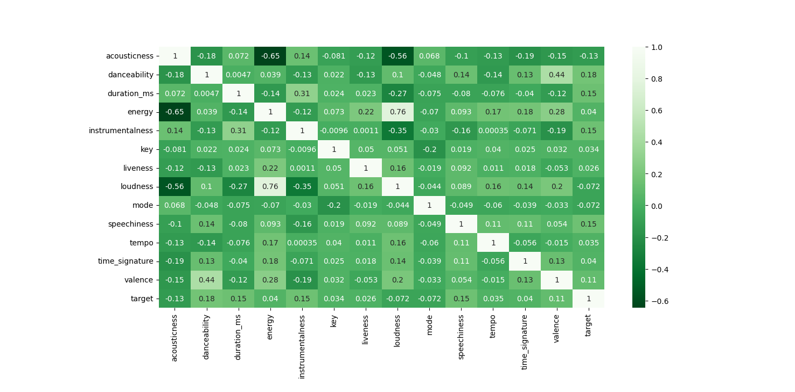

* This plot shows the correlation between pairs of variables.
* We can see that there is no strong relation of any feature with our target feature
* But, there is a positive correlation between energy and loudness, which seems quite reasonable 
* And we have a negative correlation between acousticness and energy, which also makes sense, as music which is more acoustic tends to be a soft melody with less energy and misuc with high energy have less acousticness in it, but more loudness.

****
**Liked vs. DisLiked Songs**
```
labels = ["Liked Songs"," DisLiked Songs"]
values = df['target'].value_counts().tolist()
plt.pie(values, labels = labels, autopct= '%.1f%%', shadow=True,startangle = 60)
plt.title("Liked/DisLiked Songs Distribution Pie Chart")
plt.show()
```
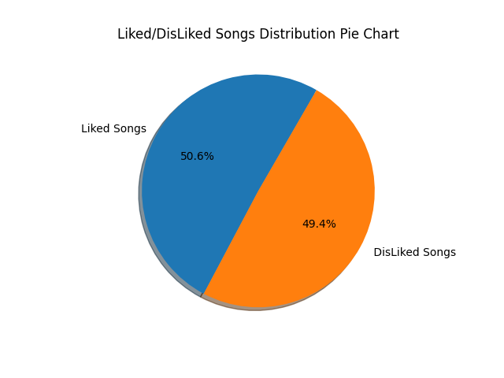
* We observe that number of liked songs(50.6%) and disliked songs(49.4%) are almost equal.

****
**Skewness and kurtosis**
* If the `skewness` is between -0.5 & 0.5, the data are nearly symmetrical.If the skewness is between -1 & -0.5 (negative skewed) or between 0.5 & 1(positive skewed), the data are slightly skewed.If the skewness is lower than -1 (negative skewed) or greater than 1 (positive skewed), the data are extremely skewed.
* `Kurtosis` is a statistical measure, whether the data is heavy-tailed or light-tailed in a normal distribution

```commandline
s_k = []
for i in data_numerical.columns:
    s_k.append([i,data_numerical[i].skew(),data_numerical[i].kurt()])
skew_kurt=pd.DataFrame(s_k,columns=['Columns','Skewness','Kurtosis'])
print(skew_kurt)
```
Output:

|     |           Columns |   Skewness |   Kurtosis |
|:----|------------------:|-----------:|-----------:|
| 0   |      acousticness |   1.658393 |   1.745621 |
| 1   |      danceability |  -0.419610 |  -0.207512 |
| 2   |       duration_ms |   2.499012 |  11.902423 |
| 3   |            energy |  -0.913010 |   0.572619 |
| 4   |  instrumentalness |   1.952755 |   2.261180 |
| 5   |               key |  -0.009360 |  -1.338827 |
| 6   |          liveness |   1.952703 |   4.095644 |
| 7   |          loudness |  -2.226556 |   7.908473 | 
| 8   |              mode |  -0.461301 |  -1.788976 |
| 9   |       speechiness |   2.309581 |   6.260201 |
| 10  |             tempo |   0.439058 |   0.041600 |
| 11  |    time_signature |  -2.234521 |  19.708947 | 
| 12  |           valence |   0.078390 |  -1.010588 |
| 13  |            target |  -0.022825 | -2.001465  |

* acousticness, durations_ms, instrumentalness, liveness, loudness, energy, danceability and speechiness are extremely skewed.

***
**Numerical Variable Analysis**
```commandline
cols = ['acousticness','danceability','energy','instrumentalness','liveness','speechiness','tempo','loudness','valence']
fig, axes = plt.subplots(3,3)
ax_no = 1
for col in cols:
    plt.subplot(3, 3, ax_no).patch.set_facecolor('#f6f5f7')
    sns.kdeplot(df.loc[(df['target'] == 1), col], color='r',
                fill=True, label='Liked')

    sns.kdeplot(df.loc[(df['target'] == 0), col], color='b',
                fill=True, label='Not Liked')
    plt.legend(['Liked', 'Not Liked'])
    ax_no += 1
fig.suptitle('Kde Plots')
plt.show()
```
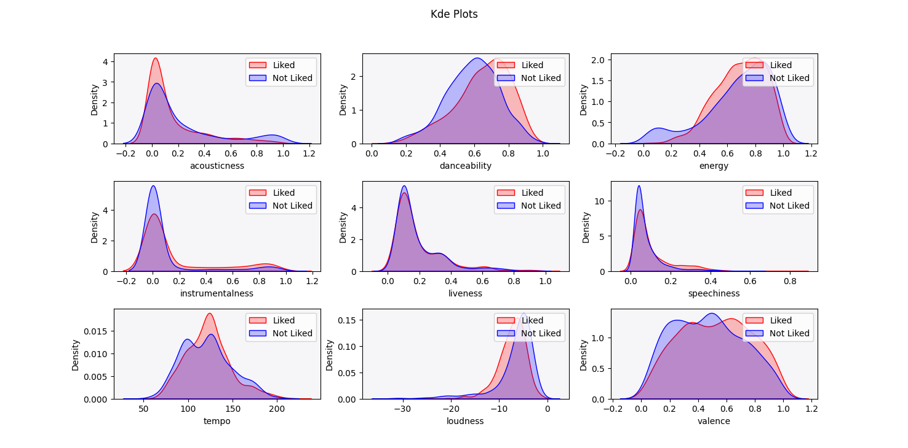

* We can now easily determine the variables which are right skewed or left skewed 
and also whether the data is heavy tailed or light tailed.

***
**Some plots to see the highest values in various fields:**
```commandline
fig,ax = plt.subplots(3,1)
top_artist_count = df.artist.value_counts()
sns.barplot(x = top_artist_count.values[:6], y= top_artist_count.index[:6], ax = ax[0])
ax[0].set_title('Artists with Most Songs')

top_five_loudest=df[["loudness","song_title"]].sort_values(by="loudness",ascending=True)[:5]
sns.barplot(x="loudness",y="song_title",data=top_five_loudest, ax = ax[1])
ax[1].set_title("Top Five Loudest")

top_ten_energetic=df[["energy","song_title","artist"]].sort_values(ascending=False,by="energy")[:10]
sns.barplot(x="energy",y="song_title",data=top_ten_energetic, ax = ax[2])
ax[2].set_title("Top 10 Energetic Songs")
plt.show()
```
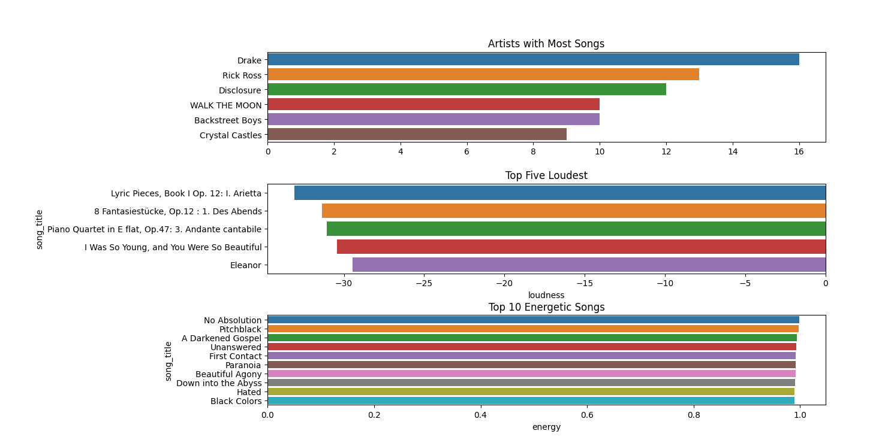

```commandline
fig,ax = plt.subplots(3,1)
top_five_artist_dancebility=df[["danceability","song_title","artist"]].sort_values(by="danceability",ascending=False)[:5]
sns.barplot(x="danceability",y="artist",data=top_five_artist_dancebility,ax=ax[0])
ax[0].set_title("Artist with most danceability song")

duration=df["duration_ms"].value_counts()[:10]
sns.barplot(x=duration.index,y=duration.values,ax=ax[1])
ax[1].set_xlabel("Time_ms")
ax[1].set_title("Most Common Duration")

top_10=df[["song_title","valence"]].sort_values(ascending=False,by="valence")[:10]
sns.barplot(y="song_title",x="valence",data=top_10,ax=ax[2])
ax[2].set_title("Songs with Most Valence")
plt.show()
```
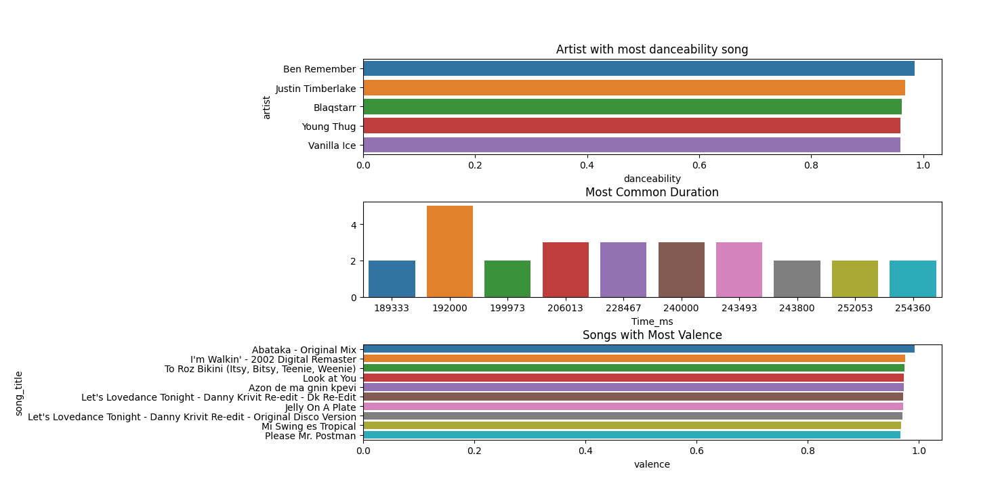

***
**Visualising using Boxplot**
```commandline
sns.set_palette("viridis_r")
ax_no = 1
for col in num_cols:
    plt.subplot(5, 3, ax_no)
    sns.boxplot(data = df, x=col)
    ax_no += 1
plt.show()
```
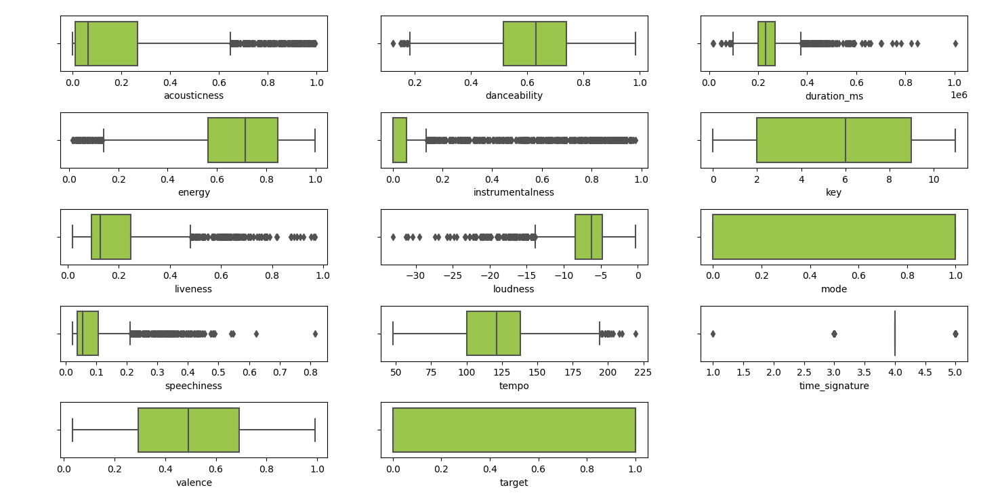


***
**Exploring Data**

```commandline
sns.set_palette("Blues_r")
ax_no = 1
for col in num_cols:
    plt.subplot(5, 3, ax_no)
    sns.histplot(data = df, x=col, bins=25, kde=True)
    ax_no += 1
plt.show()
```
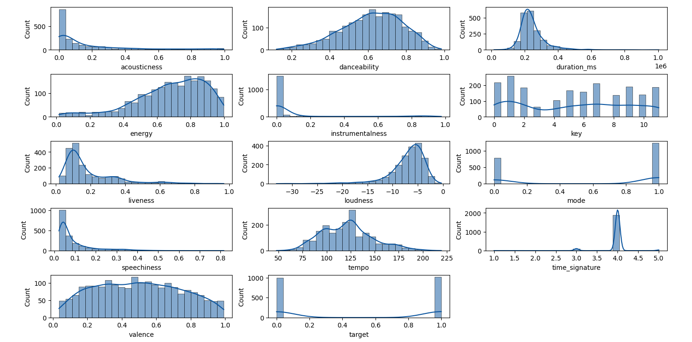

* We can visualise the distribution of each feature in our data. From the distributions we can find out which features are continuous, which are discrete, their skewness, modality, etc which helps us understand the data better.


* We now define the lists for continuous variables and discrete variables :
```
continuous_cols = ['acousticness', 'danceability', 'duration_ms', 'energy',
    'liveness', 'loudness',  'tempo',  'valence', 'speechiness', 'instrumentalness']
    
discrete_cols = ['key','mode','time_signature','target']
```

1. [ ] Distributions of Continuous Features

```commandline
fig, axes = plt.subplots(5,2)
palettes = ['viridis','Set1', 'prism', 'rocket']
axes = axes.flatten()
ax_no = 0
for col in continuous_cols:
    sns.set_palette(palettes[ax_no % 4])
    sns.histplot(data=df, x=col, hue='target', bins=25, kde=True, ax=axes[ax_no])
    ax_no += 1
fig.suptitle('Distributions of Continuous Features')
plt.show()
```
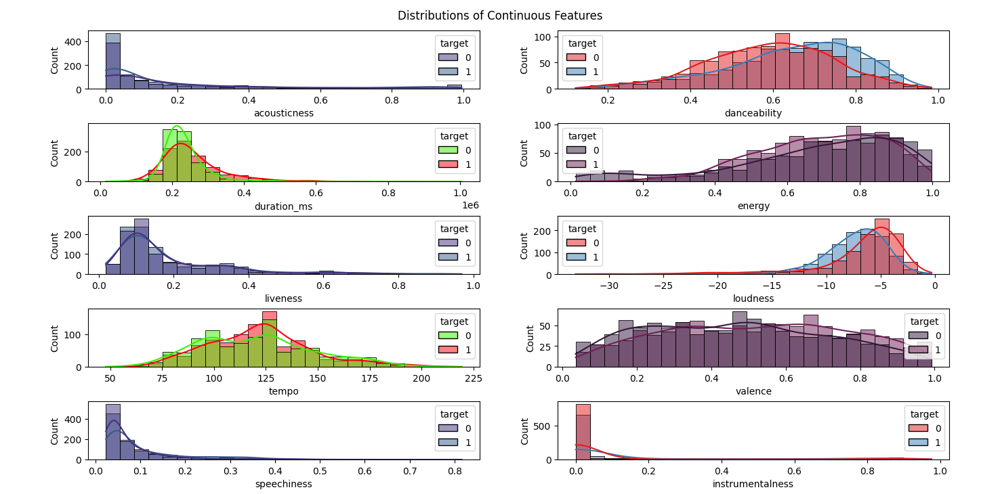

* In the plot above, we observe that for the feature `energy`, the threshold can be considered as 0.2 as it is clearly visible that below 0.2 energy value, more people tend to dislike songs. 
* Similarly, we can observe for the feature `loudness`, a reasonable threshold would be something around -5 approximately, we can predict that more users like songs when loudness < -5 and dislike songs with loudness > -5
* We can see bimodality for `tempo` when the user dislikes the songs, other features are mostly unimodal in nature

2. [ ] Distributions of Discrete Features
```commandline
sns.set_palette("Set1")
fig, axes = plt.subplots(2,2)
palettes = ['tab10', 'Paired', 'rocket', 'Set1']
axes = axes.flatten()
ax_no = 0
for col in discrete_cols:
    sns.set_palette(palettes[ax_no%4])
    sns.countplot(data = df, x= col, ax = axes[ax_no], hue='target')
    ax_no += 1
fig.suptitle('Distributions of Discrete Features')
plt.show()
```
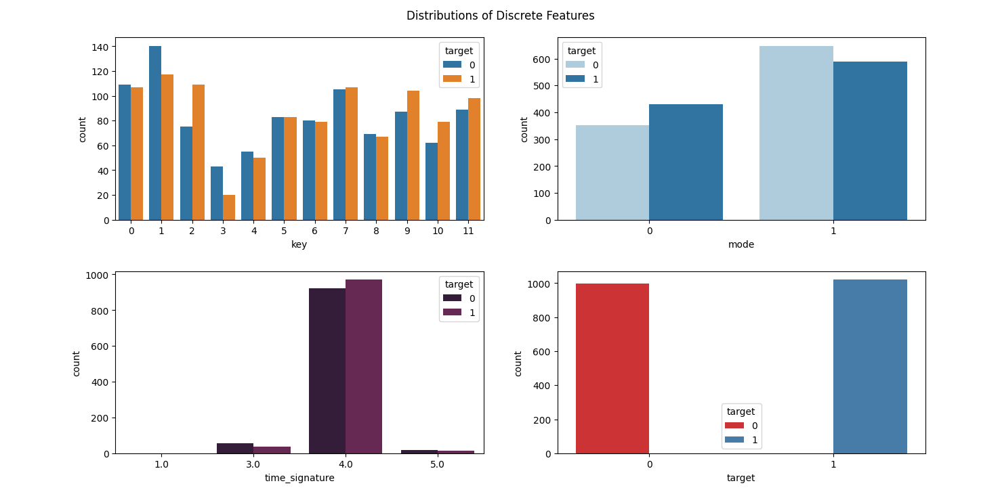

* 1 key is more than any other in our data.
* The number of songs with time_signature 4.0 are too high.
* Target is distributed almost equally.
* The number of songs of mode is more in major more than minor.

***
**Correlation Analysis**
```commandline
plt.figure()
plt.subplot(3,2,1)
sns.scatterplot(data=df,x=df['acousticness'],y=df['danceability'],hue=df['target'],palette="OrRd",style=df['target'])
plt.title('Scatterplot for acousticness vs danceability')
plt.subplot(3,2,2)
sns.scatterplot(data=df,x=df['duration_ms'],y=df['energy'],hue=df['target'],palette="OrRd",style=df['target'])
plt.title('Scatterplot for duration_ms vs enery')
plt.subplot(3,2,3)
sns.scatterplot(data=df,x=df['instrumentalness'],y=df['liveness'],hue=df['target'],palette="OrRd",style=df['target'])
plt.title('Scatterplot for instrumentalness vs liveness')
plt.subplot(3,2,4)
sns.scatterplot(data=df,x=df['loudness'],y=df['speechiness'],hue=df['target'],palette="OrRd",style=df['target'])
plt.title('Scatterplot for loudness vs speechiness')
plt.subplot(3,2,5)
sns.scatterplot(data=df,x=df['tempo'],y=df['valence'],hue=df['target'],palette="OrRd",style=df['target'])
plt.title('Scatterplot for tempo vs valence')
plt.show()
```
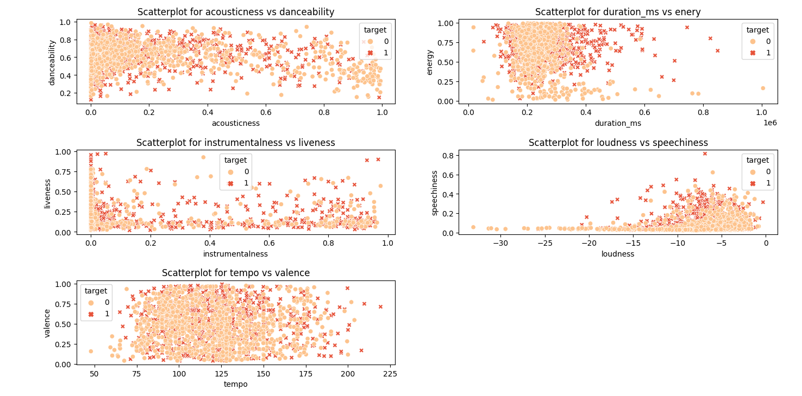

* There are few outliers in instrumentalness vs liveness, duration_ms vs energy and loudness vs speechiness.
* The instrumentalness vs liveness and loudness vs speechiness group is heavily distributed between 0 - 0.4

```
modified_df = df[['acousticness', 'danceability', 'instrumentalness', 'liveness', 'loudness', 'speechiness', 'tempo', 'valence', 'target']]
sns.pairplot(modified_df.iloc[:,1:], hue="target", palette="plasma", markers=["o", "s"])
plt.show()
```
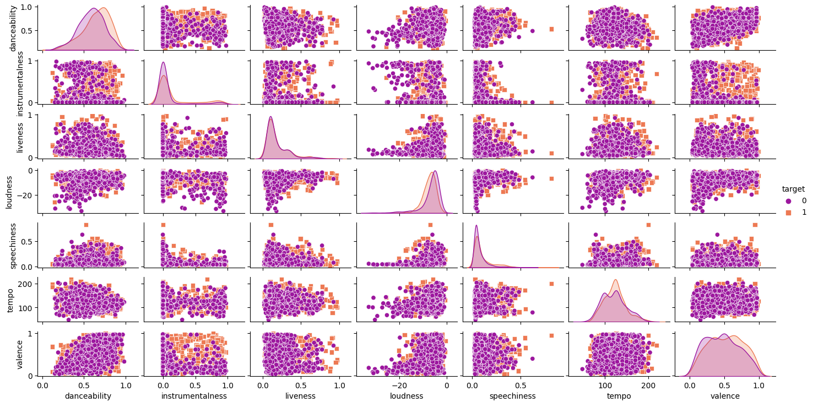
- PairPlots usually take time to run. So keep patience.

